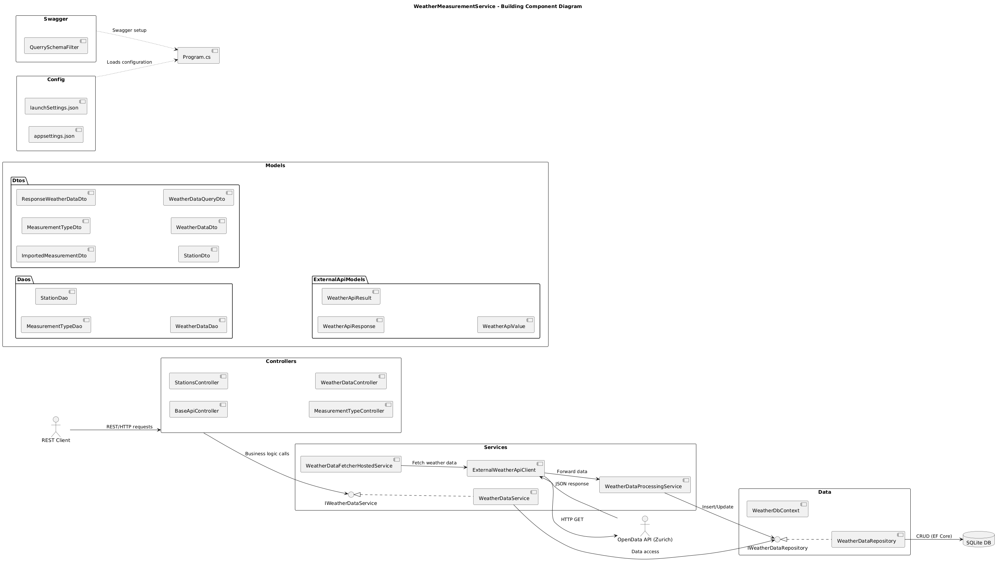

# WeatherMeasurementService

## 📝 Projektbeschreibung

Der `WeatherMeasurementService` ist ein Microservice zur Speicherung und Analyse von Wetterdaten der Wasserschutzpolizei Zürich.  
Die Anwendung bezieht externe Wetterdaten, speichert diese in einer lokalen Datenbank und stellt sie via REST-API zur Verfügung.

---

## ✅ Testaufgabe

Dieses Projekt wurde im Rahmen der **Testaufgabe für .NET Softwareentwickler (LS35.3)** der **Post CH AG** erstellt.  
Ziel war es, einen .NET REST-Service zu entwerfen, welcher Wetterdaten verarbeitet.

### Anforderungen laut Aufgabenstellung

- Daten aus externer API lesen
- Validierung, Filterung und Speicherung
- REST-Schnittstelle bereitstellen
- Unit-Tests
- Optional: Docker-Unterstützung

Die Aufgabenstellung ist in der Datei `.\docs\Testaufgabe_Bewerber.pdf` enthalten.

---

## ▶️ Build & Start

### 🔧 Debug-Modus (lokale Entwicklung)

```bash
dotnet build WeatherMeasurementService -c Debug
dotnet run --project WeatherMeasurementService
```

### 🚀 Release-Modus

```bash
dotnet build WeatherMeasurementService -c Release
dotnet run --project WeatherMeasurementService -c Release
```

## 🧪 Build und Testen

```bash
dotnet build .\WeatherMeasurementService -c Release
dotnet test .\WeatherMeasurementService.Test\WeatherMeasurementService.Tests.csproj
```

---

## 🐳 Docker Support

Die Anwendung kann als Container betrieben werden – lokal oder über Docker Hub.  
Das Dockerfile nutzt ein **Multi-Stage-Build**, um ein schlankes Runtime-Image bereitzustellen.

---

### 🔧 Lokales Docker Build & Start

```bash
# Image lokal builden
docker build -t weather-measurement-service .

# Container lokal starten
docker run -d -p 8080:80 --name weather-api-dev weather-measurement-service
```

➡️ Swagger UI erreichbar unter: 
📍 **http://localhost:8080/swagger**

---

### ☁️ Deployment auf Docker Hub

```bash
# Image taggen für Docker Hub
docker tag weather-measurement-service joel85/weather-measurement-service:latest

# Docker Hub Login
docker login

# Push zum eigenen Repository
docker push joel85/weather-measurement-service:latest
```

```bash
# Container vom Docker Hub starten
docker run -d -p 8080:80 --name weather-api joel85/weather-measurement-service:latest
```

---

### 🛑 Container stoppen & entfernen

```bash
# Container stoppen
docker stop weather-api-dev    # für lokalen Build
docker stop weather-api        # für Docker Hub Pull

# Container entfernen
docker rm weather-api-dev
docker rm weather-api
```

---

## 📝 Vorschlag für Docker Hub README (Repository-Beschreibung)

> **WeatherMeasurementService** is a .NET 9 microservice that fetches, stores, and analyzes weather data from Zürich's police water stations.  
It exposes a REST API with Swagger UI and uses SQLite for local data persistence.

### 🔧 Usage

```bash
docker run -d -p 8080:80 joel85/weather-measurement-service:latest
```

Then open [http://localhost:8080/swagger](http://localhost:8080/swagger) in your browser.


## 🔌 REST API (Swagger)

### 🌐 Swagger URL

Die REST API ist mit Swagger UI dokumentiert und erreichbar unter:  
➡️ **[https://localhost:7017/swagger](https://localhost:7017/swagger/index.html)**

### 📦 Verfügbare API-Endpunkte

Die REST-API stellt folgende Endpunkte zur Verfügung:

| HTTP-Methode | Endpoint                            | Beschreibung                                            |
|--------------|-------------------------------------|---------------------------------------------------------|
| `GET`        | `/api/weatherdata/highest`          | Höchster Messwert eines Typs im Zeitraum               |
| `GET`        | `/api/weatherdata/lowest`           | Tiefster Messwert eines Typs im Zeitraum               |
| `GET`        | `/api/weatherdata/average`          | Durchschnittswert eines Typs im Zeitraum               |
| `GET`        | `/api/weatherdata/count`            | Anzahl Messungen eines Typs im Zeitraum                |
| `GET`        | `/api/weatherdata`                  | Alle Messwerte mit vollständigen Attributen            |
| `GET`        | `/api/stations`                     | Liste aller gespeicherten Wetterstationen              |
| `GET`        | `/api/measurementtype/measurement-types` | Liste aller verfügbaren Messwerttypen            |

#### 🔍 Abfrageparameter für `weatherdata`-Endpunkte

| Parameter     | Beschreibung                          | Pflicht |
|---------------|----------------------------------------|---------|
| `start`       | Startdatum des gewünschten Zeitraums   | ✅      |
| `end`         | Enddatum des gewünschten Zeitraums     | ✅      |
| `station`     | Name der Wetterstation (z. B. "tiefenbrunnen") | ❌   |
| `measurementType` | Typ der Messung (z. B. "air_temperature") | ✅ |

Beispiel-URL:

```
GET https://localhost:7017/api/weatherdata/average?start=2025-04-01&end=2025-04-10&station=tiefenbrunnen&measurementType=air_temperature
```

---

## 📡 Architekturübersicht

Die Architektur besteht aus folgenden logischen Bereichen:

- **Web Server**: ASP.NET Core Web API inkl. Swagger UI
- **Background Services**: HostedService für automatischen Datenimport
- **Database**: SQLite Datenbank mit EF Core ORM
- **External API**: Wetterdaten über OpenData API Zürich

### 📊 Deployment Diagramm
Zeigt die Verteilung der Komponenten auf logische Knoten:


### 🛠️ Komponentenübersicht
Das folgende Komponentendiagramm zeigt die logische Aufteilung der Anwendung nach Modulen:



### 📄 Klassendiagramm
Für einen tieferen Einblick in Struktur und Beziehungen zwischen Klassen:


---

## 📡 Externe Datenquelle

Die Wetterdaten werden über folgende öffentliche Open-Data-API bezogen:

🔗 **[https://tecdottir.metaodi.ch/docs/](https://tecdottir.metaodi.ch/docs/)**

### Eigenschaften der bezogenen Messwerte

- **Stationen**: "tiefenbrunnen", "mythenquai"
- **Zeitraum**: Messwerte jeweils bis zum Vortag
- **Limitierung**: max. 100 Einträge je Abfrage
- **Sortierung**: timestamp_cet desc
- **Datenformat**: JSON

---

## 🧪 Tests

Die Anwendung wurde mit **xUnit** und **Moq** umfassend getestet.  
Der Fokus der Tests liegt auf der Absicherung der zentralen Logik, Validierungen und der REST-Schnittstelle.

### ✅ Abgedeckte Testbereiche

- Unit-Tests für alle Service-Methoden (z. B. Durchschnitt, Minimum, Maximum, Anzahl, Gesamtabfrage)
- Validierungsszenarien (z. B. ungültige Eingaben, nicht vorhandene Ressourcen)
- Tests für Randfälle (z. B. keine Daten vorhanden)
- Abdeckung des gesamten Kontrollflusses inklusive Fehlerbehandlung
- Integrationstests für Controller und Datenzugriffsschicht

### 🔍 Beispiele getesteter Szenarien

- Fehler bei inkonsistentem Datumsbereich (z. B. Start > Ende)
- Prüfung auf Existenz von Stationen und Messwerttypen
- Rückgabe von `null` oder leeren Mengen bei fehlenden Daten
- Korrekte Berechnung statistischer Kennzahlen
- API-Fehlermeldungen und Statuscodes (400, 404, 500)

> 🧪 Ziel der Tests: **Robustheit, Nachvollziehbarkeit und Wartbarkeit der Applikation sicherstellen**

---

## 💠 Datenbank

Das Projekt verwendet eine relationale **SQLite**-Datenbank zur persistenten Speicherung von Wettermessdaten.

### 📊 Datenmodell

Die Datenbank besteht aus drei Haupttabellen:

#### `WeatherData` (Messwerte)
Speichert die eigentlichen Wetterdaten.

| Spalte           | Beschreibung                          | Beispiel              |
|------------------|----------------------------------------|------------------------|
| `WeatherDataId`  | Primärschlüssel                        | 1                      |
| `StationId`      | Fremdschlüssel zu `Station`            | 2                      |
| `MeasurementTypeId` | Fremdschlüssel zu `MeasurementType` | 3                      |
| `TimestampUtc`   | Zeitpunkt der Messung (UTC)            | 2025-04-05T21:50:00Z   |
| `Value`          | Gemessener Wert                        | 13.2                   |
| `Unit`           | Einheit der Messung                    | °C, hPa                |

#### `Station` (Stammdaten Wetterstation)
Beinhaltet den Namen der Station.

| Spalte     | Beschreibung             | Beispiel         |
|------------|---------------------------|------------------|
| `StationId`| Primärschlüssel           | 1                |
| `Name`     | Name der Wetterstation    | Tiefenbrunnen    |

#### `MeasurementType` (Typ der Messung)
Definiert Art und Standard-Einheit der Messung.

| Spalte           | Beschreibung                          | Beispiel              |
|------------------|----------------------------------------|------------------------|
| `MeasurementTypeId` | Primärschlüssel                    | 2                      |
| `TypeName`       | Typenbezeichnung                     | air_temperature        |
| `DefaultUnit`    | Standard-Einheit                      | °C                     |

### 🔄 Beziehungen

- Eine `Station` kann viele `WeatherData`-Einträge haben
- Ein `MeasurementType` kann vielen `WeatherData`-Einträgen zugeordnet sein
- Jeder `WeatherData`-Eintrag ist einer Station **und** einem Messungstyp zugewiesen

> Die Struktur ist optimiert für einfache Aggregationen (Max, Min, Avg) und historische Abfragen.

